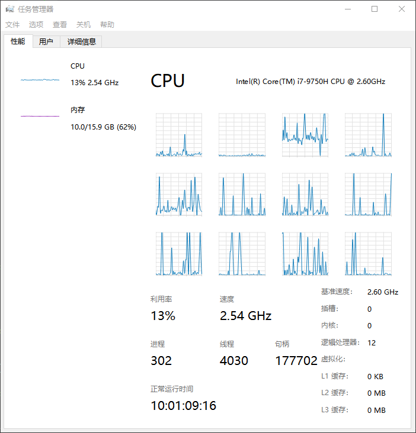
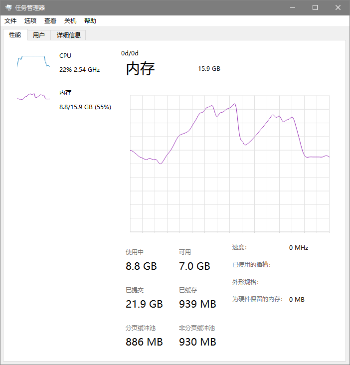
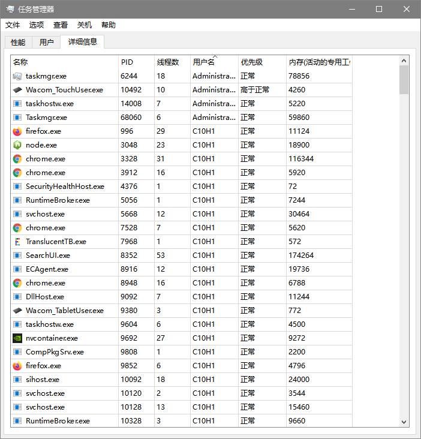

## 简介

操作系统课程设计上写的简陋的Windows任务管理器，基于win32 API与Qt 6.2.2 GPLv3开源版. GUI风格仿照的是Win10自带任务管理器.

## 目录结构

 - [source/](https://github.com/ekv0/my-boring-os-course-design/tree/master/source) 源代码目录
 - [media/](https://github.com/ekv0/my-boring-os-course-design/tree/master/media) 一些截图
 - [dia/](https://github.com/ekv0/my-boring-os-course-design/tree/master/dia) 使用[drawio](https://github.com/jgraph/drawio-desktop)绘制的一些图
 - [report/](https://github.com/ekv0/my-boring-os-course-design/tree/master/report) 当时的课设报告
 - [slide/](https://github.com/ekv0/my-boring-os-course-design/tree/master/slide) 当时的展示用幻灯片

## 界面展示

全部截图可见[media/](https://github.com/ekv0/my-boring-os-course-design/tree/master/media)

## License

GPLv3

